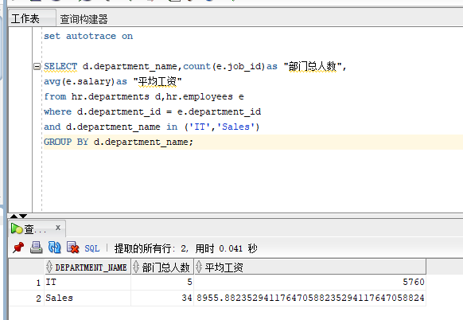
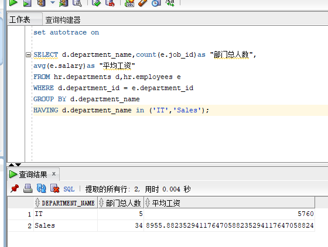
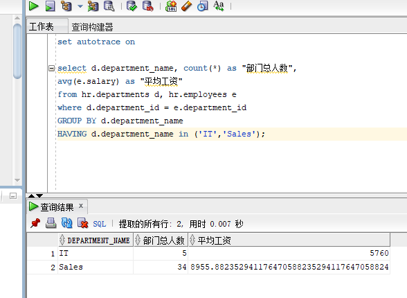

# 姓名: 阳天昊  学号: 201810414226  班级: 软工二班

# 实验1：SQL语句的执行计划分析与优化指导

## 实验目的:

dian分析SQL执行计划，执行SQL语句的优化指导。理解分析SQL语句的执行计划的重要作用

## 实验内容:

• 对Oracle12c中的HR人力资源管理系统中的表进行查询与分析。

• 首先运行和分析教材中的样例：本训练任务目的是查询两个部门('IT'和'Sales')的部门总人数和平均工资，以下两个查询的结果是一样的。但效率不相同。

• 设计自己的查询语句，并作相应的分析，查询语句不能太简单。

## 查询语句

### 查询一

set autotrace on

SELECT d.department_name,count(e.job_id)as "部门总人数",
avg(e.salary)as "平均工资"
from hr.departments d,hr.employees e
where d.department_id = e.department_id
and d.department_name in ('IT','Sales')
GROUP BY d.department_name;

#### 分析一

     首先用where来筛选符合条件（d.department_id = e.department_id，IT or Sales）的所有匹配项，再用group by来按部门名分组。最后聚合函数count统计人数并avg计算平均工资

### 查询二

set autotrace on

SELECT d.department_name,count(e.job_id)as "部门总人数",
avg(e.salary)as "平均工资"
FROM hr.departments d,hr.employees e
WHERE d.department_id = e.department_id
GROUP BY d.department_name
HAVING d.department_name in ('IT','Sales');

#### 分析二

     首先用where筛选部门id相等的项（d.department_id = e.department_id），由于没有做部门判断，所以接着要用group by按部门名分组，然后对每个分组筛选部门再IT或Sales中的项，最后由聚合函数 count统计人数并avg计算平均工资

### 语句比较

    查询语句二的执行效率要高于查询语句一。因为查询语句一的每条匹配项都会判断部门是否再条件里，数据量较大，会明显会降低查询效率。而查询语句二选择的是对分组后的项进行部门判断。
    优化指导： There are no recommendations to improve the statement.

### 自我设计

set autotrace on

select d.department_name, count(*) as "部门总人数",
avg(e.salary) as "平均工资"
from hr.departments d, hr.employees e
where d.department_id = e.department_id
GROUP BY d.department_name
HAVING d.department_name in ('IT','Sales');

#### 分析三

    我们在统计部门人数的时候可以直接统计全部的人数

